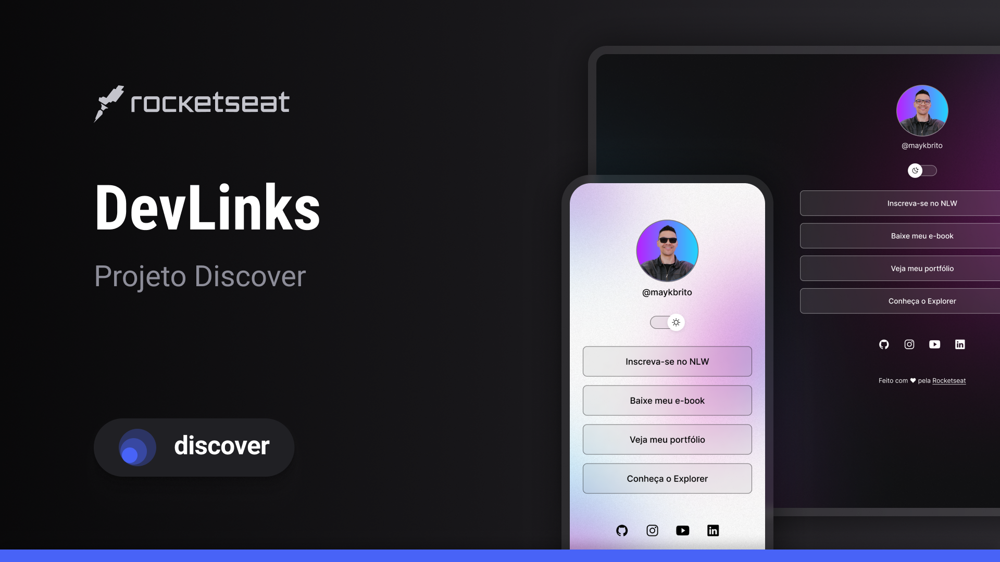

# Aprensetação
Meu nome é Cauã Borges estudante do primeiro período de ciência da computação na universidade federal de São Carlos

# Meu Primeiro Projeto

    

Este é o meu primeiro projeto desenvolvido seguindo o curso Discover da Rocketseat. Aqui, aprendi os fundamentos de HTML, CSS e JavaScript, e apliquei esse conhecimento para criar uma aplicação simples.

## Funcionalidades

- [ ] Área de Portfólio ou Projetos
- [ ] Mudança de tema(dark/light mode)
- [ ] Apresentação do perfil

## Contribuição

Contribuições são sempre bem-vindas! Se você tiver alguma sugestão ou encontrar algum problema, sinta-se à vontade para abrir uma issue ou enviar um pull request.

## Licença

Este projeto está licenciado sob a [MIT License](LICENSE).